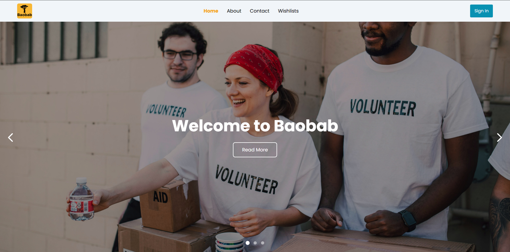
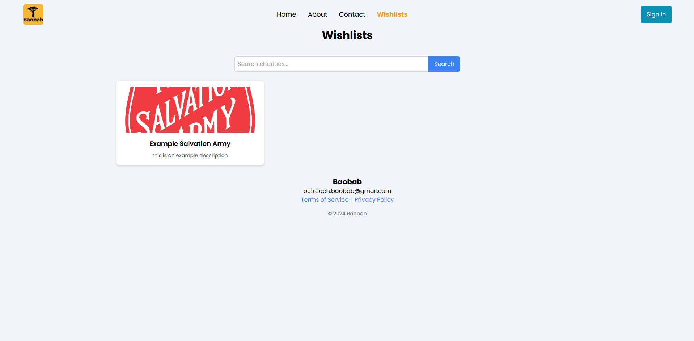
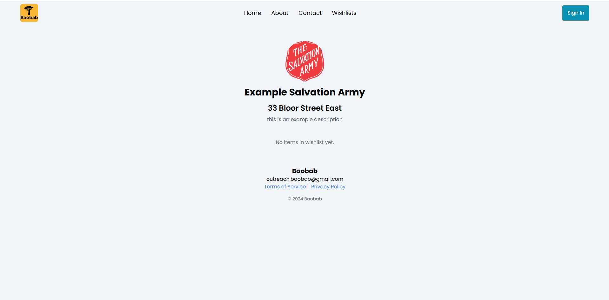

# Baobab

[outreachboabab.org](https://outreachbaobab.org/)

Baobab is a platform designed to make charitable giving simple, transparent, and impactful. Charities can sign up to create wishlists of essential goods they need, such as shampoo, canned food, and clothing. Donors can then browse these wishlists and directly purchase items, which are shipped to the charities via Amazon.

By streamlining the donation process, Baobab ensures that charities receive exactly what they need while allowing donors to see the real impact of their contributions.

## Acknowledgements

 - [The Inspiration for Baobab's Model](https://throne.com/landing)
 - [The Founders](https://theforge.mcmaster.ca/startups/local-reach/)

## Contributors

- [Michael Ferreira](https://www.github.com/michaeljf07)
- [Shiven Taneja](https://www.github.com/ShivenT)
- [Gurshaan Sidhu](https://www.github.com/Mr-Shaan)

## Feedback

If you have any feedback, please reach out to us at outreach.baobab@gmail.com
